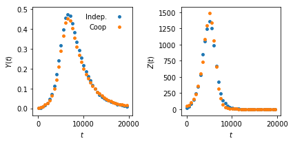

# experiments

Scripts and datasets used to produce all the results presented in [https://arxiv.org/abs/1905.xxxxxx](https://arxiv.org/abs/1905.xxxxxx) (both the manuscript and the Supplementary Materials).

##  `time_series/`

This sub-directory contains the raw and processed time series used in the experiments.

### `time_series/clustered_networks/`

These time series track (one realization of) two diseases evolving on a random network of 10,000 nodes, where each node belong to two randomly selected 5 cliques.
In `independent.txt`, the two diseases have a (flat) transmission rate of 3/10 and a recovery rate of 1/3, spreading without interaction. We show the evolution of only one of them.
In `interacting.txt`, the two diseases have a transmission rate 7/10 and a recovery rate 1/7, but they interact positively by increasing their transmission rate by a factor of 7 whenever the other disease occurs on the same contact. We again only track one.

### `time_series/SM/`

These 12 times are all noisy versions of a same prototypical time-series, used to validate the inference methods in the SM.

The original time series is generated with the complex SIR model, using the coefficients xi = [0.5, 1.5, 0.05, 0.25, 2, 3, 1, 1, 0.5] for the Bernstein polynomial parametrization of beta(I), a recovery rate of gamma=0.1, the initial condition (S0, I0, R0) = (0.999, 0.001, 0) and a population size of 100 000 individuals.

The resulting contagion function is shown below, with gamma as a straight line for comparison:

and it is stored in [time_series/SM/beta.txt](time_series/SM/beta.txt).

We create noisy measurements of the time series by sparsifying it (we retain T equally paced points), and drawing the observations from a normal distribution centered on the true value.
Because incidence data is measured in number of individuals while prevalence is measured as a fraction of the population, we use different variances specific to the type of measurement.
If in an experiment, sigma^2 is the variance applied to the prevalence measurement, then 10 * sigma^2 * population * T is the variance applied to the incidence data.
Note that we (a) truncate the normal distribution to ensure that the results always fall within the allowed ranges---e.g., prevalence cannot go outside of [0, 1]--- and (b) round incidence numbers to the nearest integer.

In one set of observations, we set sigma^2=0.02 for the incidence data and vary T = 50, 100, 250.
The resulting time series are [time_series/SM/T50_sigma_0p02.txt](time_series/SM/T50_sigma_0p02.txt),  [time_series/SM/T100_sigma_0p02.txt](time_series/SM/T100_sigma_0p02.txt), [time_series/SM/T250_sigma_0p02.txt](time_series/SM/T250_sigma_0p02.txt), and shown below:

In the other set of observations, we set T=100 and let sigma^2 = 0, 0.01, 0.05.
The resulting time series are [time_series/SM/T100_sigma_0p00.txt](time_series/SM/T100_sigma_0p00.txt),  [time_series/SM/T100_sigma_0p01.txt](time_series/SM/T100_sigma_0p01.txt), [time_series/SM/T100_sigma_0p05.txt](time_series/SM/T100_sigma_0p05.txt), and shown below:

##  `scripts/`

**For the main text:**

* `scripts/clustered_networks.py` Generates the results of Figure 3 (simulated interacting epidemics on a clustered network).

**For the supplementary materials:**

- `scripts/sparsity_test.py` Generates the result of SM Figure 2 (simulated time series, varying sampling frequency).
- `scripts/noise_test.py`  Generates the results of SM Figure 3 (simulated time series, varying noise levels).
- `scripts/prior_test.py` Generates the results of SM Figure 4-5 (effect of prior misspecification).

Note that SM Figure 6 re-uses results generated by other scripts.
